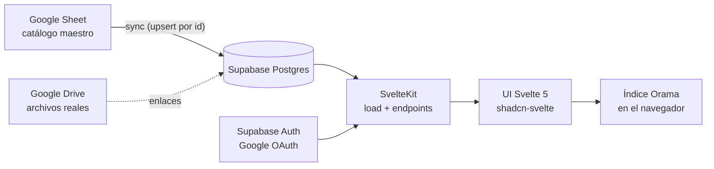

# Arquitectura

## Diagrama general



## Decisiones (ADR resumidas)

### AD-1 · Híbrido Sheet → BD (no Sheet como backend)
El Sheet es la herramienta de **edición masiva** para colaboradores; la web siempre lee de
Postgres. Un endpoint de sync hace upsert por `id` estable (columna obligatoria en el Sheet).
Todo lo dinámico (valoraciones, favoritos, accesos…) vive solo en la BD.
**Consecuencia:** sin ID estable no hay sync seguro; el ID nunca se recicla.

### AD-2 · SvelteKit sobre Astro
La página principal *es* la app (filtros, sesión, animaciones en toda la superficie);
las "islas" de Astro no aportan y sí friccionan. Svelte 5 runes + transiciones nativas +
View Transitions API para tarjeta→ficha.

### AD-3 · Búsqueda en cliente con Orama
~1.500 recursos ≈ cientos de KB: el índice completo viaja al navegador (endpoint JSON
cacheado) y toda búsqueda/faceta es a 0 ms. Orama trae facetas con contadores y, a futuro,
búsqueda vectorial/híbrida (fase IA sin cambiar de motor).

### AD-4 · Supabase como backend
Postgres + Auth Google + Storage + RLS en tier free. Los roles y la protección de campos
se implementan con RLS y vistas (columnas protegidas solo para autenticados/autorizados).
pgvector disponible para la fase 5.

### AD-5 · Campos protegidos por visibilidad, no tablas duplicadas
La tabla `recurso` marca columnas de visibilidad. Una **vista pública** expone solo lo
público; los clientes autenticados con permiso consultan la tabla/vista completa vía RLS.

## Estructura de la app

```
app/src/
  lib/
    components/ui/     → shadcn-svelte (generado)
    components/        → componentes propios (RecursoCard, FiltroFaceta, …)
    server/            → clientes Supabase server-side, sync Sheet
    search/            → índice Orama, tipos de facetas
    utils.ts
  routes/
    +layout.svelte     → shell, header, sesión
    +page.svelte       → buscador principal (la app)
    recurso/[id]/      → ficha del recurso
    enviar/            → envío rápido de recursos
    admin/             → revisión, sync, stats, usuarios
    auth/              → callback OAuth
```

## Convenciones de datos

- Tablas y columnas en **español**, singular (`recurso`, `perfil`, `valoracion`).
- Toda tabla con `created_at timestamptz default now()`; RLS activado siempre.
- Enum `rol_usuario`: `consulta | edicion_local | editor | administrador | consulta_externa`.
- El esquema canónico es `supabase/migrations/` (nunca editar migraciones aplicadas).

## Entornos

- **Producción**: Vercel (adapter-vercel ya configurado) + proyecto Supabase `mcm-banco-recursos`
  (⚠️ pendiente de crear: límite free alcanzado en la org). Variables en `app/.env.example`.
